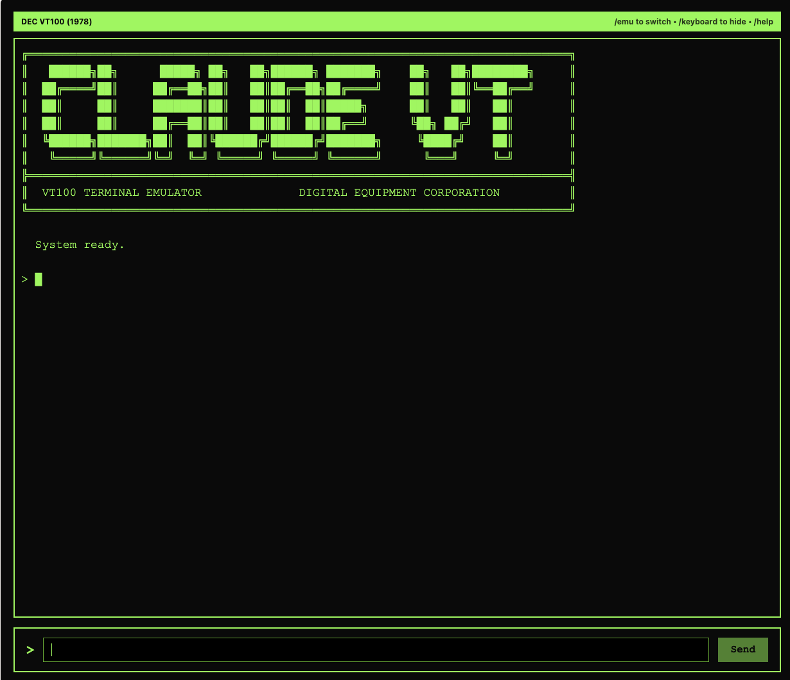

# Retro Emulator



Chat with Claude through the terminals and home computers of the late 1970s and 1980s. Each emulator recreates the look, feel, and personality of a classic machine -- complete with authentic boot sequences, period-correct column widths, and era-appropriate response styles. Type a message and get a reply that feels like it belongs on the original hardware.

The app runs entirely in the browser with a lightweight local proxy that keeps your API key on your machine.

## Available Emulators

18 machines spanning 1977-1988, sorted by release year:

| Year | Machine | Description |
|------|---------|-------------|
| 1977 | **Apple ][** | The machine that launched Apple |
| 1977 | **Commodore PET** | The first all-in-one personal computer |
| 1977 | **TRS-80** | Radio Shack's groundbreaking microcomputer |
| 1978 | **DEC VT100** | The terminal that defined terminal emulation |
| 1979 | **Atari 800** | Atari's powerful 8-bit home computer |
| 1980 | **VIC-20** | The friendly computer |
| 1980 | **TRS-80 CoCo** | The Color Computer -- Tandy's colorful home machine |
| 1981 | **MS-DOS** | The operating system that powered the PC revolution |
| 1981 | **BBC Micro** | The British educational computer that taught a generation |
| 1981 | **TI-99/4A** | Texas Instruments' colorful home computer |
| 1982 | **Commodore 64** | The best-selling home computer of all time |
| 1982 | **ZX Spectrum** | Sinclair's iconic British microcomputer |
| 1983 | **MSX** | The Japanese home computer standard |
| 1984 | **Macintosh** | The computer for the rest of us |
| 1984 | **Amstrad CPC** | The colorful British rival to the Spectrum |
| 1985 | **Commodore Amiga** | Ahead of its time in every way |
| 1985 | **Atari ST** | The Jackintosh -- powerful 16-bit computing |
| 1988 | **NeXTSTEP** | Steve Jobs' vision of the future |

Switch emulators at any time with `/emu <name>` (e.g., `/emu c64`). Type `/list` for the full list in-app.

## Setup (Bring Your Own Key)

1. Create a `.env` file in the repo root:

```bash
ANTHROPIC_API_KEY=your_key_here
```

2. Start the proxy:

```bash
npm run proxy
```

Optional: override the port (default `3001`):

```bash
PROXY_PORT=3001 npm run proxy
```

3. Point the frontend at the proxy by defining a base URL before the app loads:

Option A: Vite env (recommended for builds)

Create or update `.env`:

```bash
VITE_EMULATOR_API_BASE_URL=http://localhost:3001
```

Option B: Global override (useful for static hosting or quick tests)

```html
<script>
  window.__EMULATOR_API_BASE_URL__ = 'http://localhost:3001';
</script>
```

The client will call `http://localhost:3001/v1/messages`, and the proxy injects the API key.

## One-Command Dev (Proxy + App)

1. Install dependencies:

```bash
npm install
```

2. Run the dev servers:

```bash
npm run dev
```

This starts the proxy on `http://localhost:3001` and the app on Vite's dev server (typically `http://localhost:5173`).

## Notes

- The proxy is intentionally minimal and does not store data.
- The proxy binds to `127.0.0.1` by default and is intended for local use only.
- If you ever expose the proxy publicly, add authentication and rate limiting first.
- The client does not accept browser-injected API keys; use the proxy.
- If you change the proxy host or port, update the `connect-src` directive in `index.html` to allow that origin.
